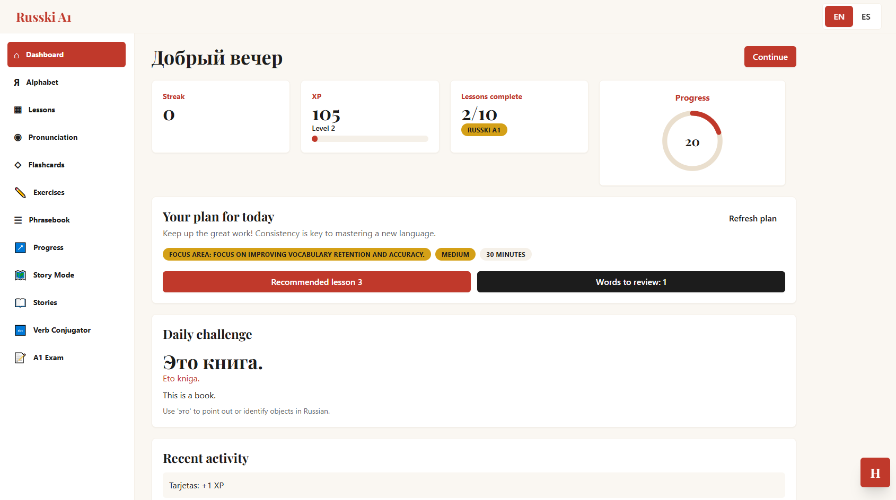
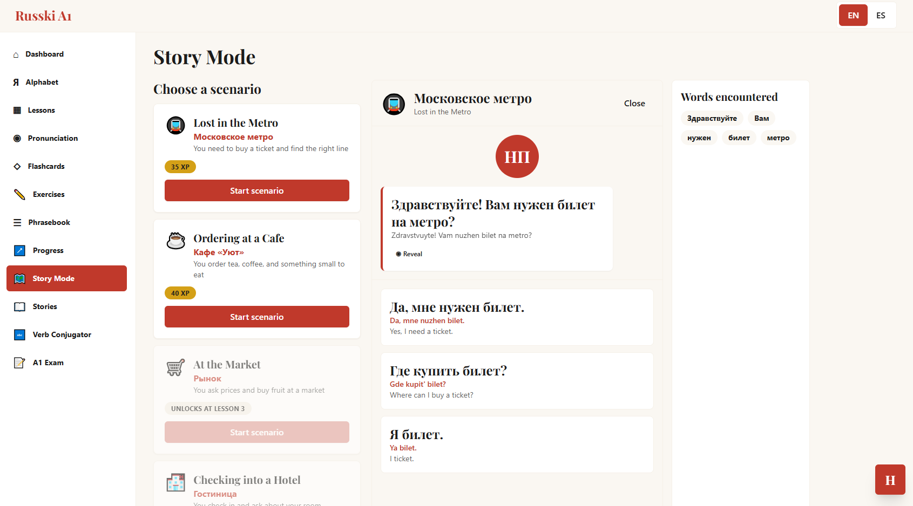
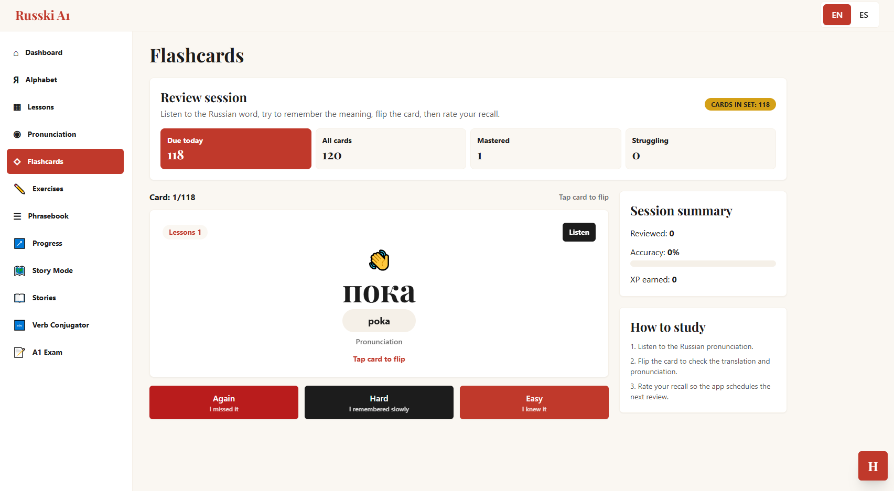

# Russki A1

Production-quality Russian A1 learning app built for a developer portfolio with React 18, TypeScript, Vite, Tailwind CSS, React Router, Zustand, the Web Speech API, and GPT-4o powered tutoring.

## Features

- Bilingual English and Spanish interface
- Complete Cyrillic alphabet practice with pronunciation metadata
- Ten A1 lessons with vocabulary, grammar, sentences, and quizzes
- AI pronunciation scoring, hints, error explanations, writing checks, and Natasha tutor chat
- Web Speech API recording wrapper with browser support checks
- SM-2 flashcard scheduling and mastery tracking
- Phrasebook with 84 bilingual phrases across six categories
- Progress dashboard, XP history, achievements, pronunciation heatmap, export and reset
- Responsive PWA shell with mobile bottom navigation

## Setup

```bash
npm install
npm run dev
```

Create a local key during onboarding or set:

```bash
VITE_OPENAI_KEY=your_key_here
```

## Scripts

```bash
npm run dev
npm run build
npm run preview
npm run lint
```

## Screenshots

### Dashboard


### Story Mode


### Flashcards


## Tech Stack

React 18, TypeScript, Vite, Tailwind CSS, React Router v6, Zustand, OpenAI GPT-4o, Web Speech API.
